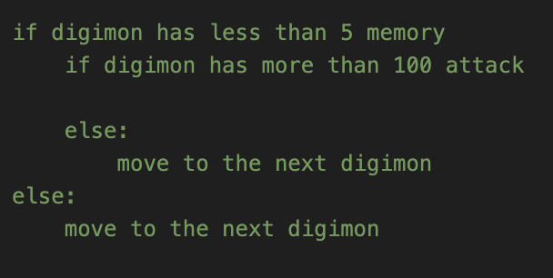
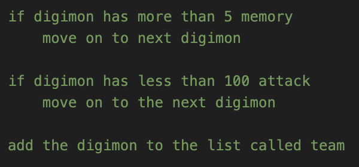

For the first function, finding the average speed of all Digimon, my thought process went straight to creating a list of all the speeds and then using the statistics fmean function to find the mean of the list. I used a CSV Dict Reader because then I could just access the speed in each for loop using the key ‘speed’; however, the value it returned was a string, and fmean only takes in numerical values. Therefore, I had to convert the string into a float and then return the fmean of the list of speeds.

To count the number of Digimon with a specific attribute, I knew I would have to loop through all the Digimon and then check if the Digimon’s attribute matched the specified attribute. If that was the case, I could add 1 to a total count and return the total count at the end. I again used a Dict Reader to access the key of the specified category, then I could compare the value with the specified attribute and either add 1 to count if the specified attribute was the same as the current Digimon’s attribute or just continue to the next iteration of the for loop. (go to the next Digimon)

In order to create a team of 3 Digimon that have 15 or less memory and 300 or more attack, I just divided both categories per Digimon. If 15 memory is the max for three Digimon, then I just need to find 3 Digimon that each take less than or equal to 5 memory. Similarly, if 3 Digimon’s attack needed to total over 300, then each Digimon could have more than 100 attack for that to work. So for each Digimon, I would just have to check whether it had five or less memory and 100 or more attack. 

However, instead of having 2 nested if statements I decided to use check the if teh requirement was not met to make my code cleaner. For example instead of having 

{: .mx-auto.d-block :}

I would have 

{: .mx-auto.d-block :}

 However, when I returned the list, I had a list of more than 10 Digimons, so I added another if statement checking if the length of the list of Digimons is equal to 3 because if there are already 3 Digimon in the team we can break out of the for loop because we don’t need to loop through the rest of the Digimons since the requirement is met.
